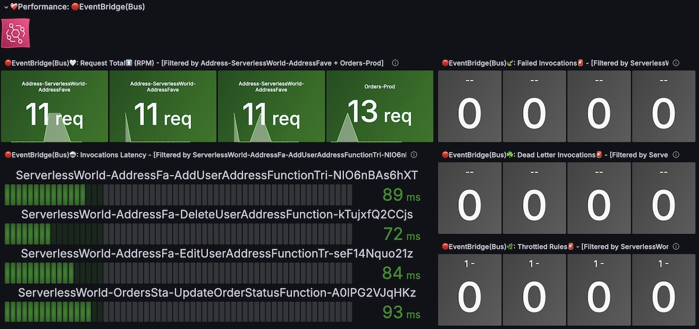
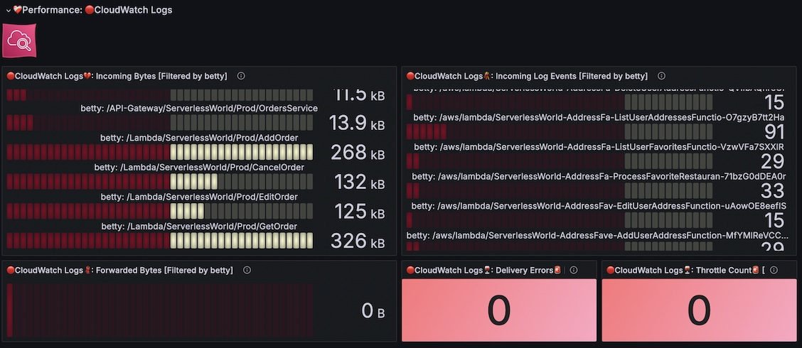
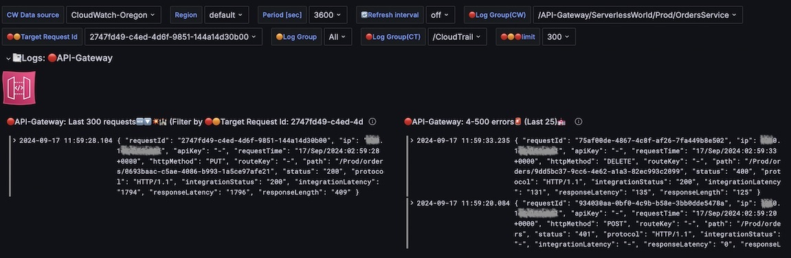

# AWS Native Cross-account Observability Dashboard

 

    

Welcome to the official site for the <mark>**AWS Native Cross-account Observability Dashboard**</mark>.  
This project provides A comprehensive observability solution for AWS environments, meticulously designed following <mark>**the AWS Well-Architected Framework**</mark>. (`SEC01-BP01`: a multi-account strategy, `SEC04-BP01`: centralizing logs, etc.)[^1]

 

---

 

## 🪩 Table of Contents

- [AWS Native Cross-account Observability Dashboard](#aws-native-cross-account-observability-dashboard)
  - [🪩 Table of Contents](#-table-of-contents)
  - [🪩 Overview](#-overview)
    - [☻ The #AWSAlwaysFreeChallenge](#-the-awsalwaysfreechallenge)
  - [🪩 Key Features](#-key-features)
    - [🚀AWS Configuration Management](#aws-configuration-management)
    - [🚀AWS Serverless Overview](#aws-serverless-overview)
    - [🚀AWS Serverless Observability Monitoring👀](#aws-serverless-observability-monitoring)
  - [🪩 More Screenshots](#-more-screenshots)
    - [🚀AWS Configuration Management](#aws-configuration-management-1)
      - [✰ 🟢Free Tier \& Cost Explorer](#-free-tier--cost-explorer)
      - [✰ 🔴AWS Organizations Insights](#-aws-organizations-insights)
      - [✰ 🔴AWS Identity Center Dashboard](#-aws-identity-center-dashboard)
      - [✰ Multi-account 🔴IAM Insights](#-multi-account-iam-insights)
      - [✰ ☁️Centralized 🔴CloudTrail Logs](#-️centralized-cloudtrail-logs)
      - [✰ Inspecting JSON Details](#-inspecting-json-details)
    - [🚀AWS Serverless Overview](#aws-serverless-overview-1)
      - [✰ ☁️Centralized Observability Metrics (🔴API-Gateway)](#-️centralized-observability-metrics-api-gateway)
      - [✰ ☁️Centralized Observability Metrics (🟠Lambda)](#-️centralized-observability-metrics-lambda)
      - [✰ ☁️Centralized Observability Metrics (🔵DynamoDB)](#-️centralized-observability-metrics-dynamodb)
      - [✰ ☁️Centralized Observability Metrics (🔴EventBridge(Bus))](#-️centralized-observability-metrics-eventbridgebus)
      - [✰ ☁️Centralized Observability Metrics (🔴SQS)](#-️centralized-observability-metrics-sqs)
      - [✰ ☁️Centralized Observability Metrics (🔴Cognito)](#-️centralized-observability-metrics-cognito)
      - [✰ ☁️Centralized Observability Metrics (🔴CloudWatch Logs)](#-️centralized-observability-metrics-cloudwatch-logs)
    - [🚀AWS Serverless Observability Monitoring👀](#aws-serverless-observability-monitoring-1)
      - [✰ ☁️Centralized CloudWatch Logs insights (🔴API-Gateway)](#-️centralized-cloudwatch-logs-insights-api-gateway)
      - [✰ ☁️Centralized CloudWatch Logs insights (🟠Lambda)](#-️centralized-cloudwatch-logs-insights-lambda)
      - [✰ ☁️Centralized 🔵X-Ray Distributed tracing and Service Map](#-️centralized-x-ray-distributed-tracing-and-service-map)
      - [✰ ☁️Centralized 🔴CloudTrail API Traces](#-️centralized-cloudtrail-api-traces)
  - [🪩 Getting Started](#-getting-started)
  - [🪩 License](#-license)

---

 

## 🪩 Overview

The <mark>**AWS Native Cross-account Observability Dashboard**</mark> is composed of three parts and integrates seamlessly with **the AWS Management Console** (🔴CloudWatch Logs Insights / 🔴CloudTrail / 🔵X-Ray).  

- The **🚀AWS Configuration Management** provides deep insights into Identity and Access Management within a complex AWS environment using a multi-account strategy.  
- **Centralized Monitoring for AWS Services**:
  - The **🚀AWS Serverless Overview** / **🚀AWS Serverless Observability Monitoring👀** offer deep insights into the **AWS Serverless World**, based on the principles of <mark>Cloud Native Observability theory</mark> (Logs, Metrics (RED/USE patterns), Traces, Service maps, etc.).[^2]

---

 

### ☻ The #AWSAlwaysFreeChallenge

This project, as part of the <mark>**#AWSAlwaysFreeChallenge**</mark>, is dedicated to driving innovation through <mark>**no-cost**</mark>(Pay-As-You-Go), open-source solutions.  
By leveraging advanced techniques and open-source tools, we aim to provide <u>alternatives that match or even surpass the functionality</u> of expensive **AWS premium services** (often costing $4-5 digits per month)[^3]🥲, such as Amazon OpenSearch, Amazon Athena, and Managed Grafana.  
Our goal is to empower companies and developers with high-performance, cost-efficient solutions that deliver robust cloud observability without the financial burden of premium pricing.

---

 

## 🪩 Key Features

---

 

### 🚀AWS Configuration Management 

 
|✅ Features| [☀️**Grafana's download site**](https://grafana.com/grafana/dashboards/21814-aws-configuration-management/) |
|---|---|
|🟢**Cost and Usage Tracking:**   |Visualize your AWS Free Tier usage and associated costs to manage your cloud expenditure effectively.|
|🔴**AWS Organizations Insights:**     |Monitor organizational units, accounts, policies, and access reports, enabling you to manage your AWS environment efficiently.|
|🔴**AWS Identity Center Dashboard:**   |Visualize workforce user assignments, permission sets, and identity store details.|
|🔴**IAM of Multi-Account AWS Environment:** |Gain detailed insights into IAM roles, policies, and user activities from **all accounts** to enhance security and compliance.|
|Centralized **🔴CloudWatch** and **🔴CloudTrail Logs:** |Monitor and filter the latest AWS CloudTrail requests, including details from AWS Organizations, Identity Center, and IAM.|

---

 

### 🚀AWS Serverless Overview

🫶🏻 This dashboard is designed following the <mark>**RED Pattern**</mark> (Rate, Errors, Duration) and <mark>**the Four Golden Signals**</mark> (Latency, Traffic, Errors, and Saturation), ensuring comprehensive observability and monitoring of your AWS Serverless architecture.

|✅ Features|[☀️**Grafana's download site**](https://grafana.com/grafana/dashboards/21933-aws-serverless-overview/) |
|---|---|
|🔵**AWS X-Ray Trace Statistics:** |- **High Level Overall**: This helps you to get your system health across all accounts in your Organization.|
|🔴**API Gateway Performance Monitoring:**  |- **Request Total** (RPM): Monitor total API requests with counts for each endpoint to see traffic trends and request patterns. - **Response Time** (Max): Analyze maximum response times to identify potential bottlenecks in API performance. - **Integration Response Time**: Track time taken to integrate with back-end services, helping diagnose slow integrations. - **4xx and 5xx Error Analysis**: View paths with the highest errors, along with HTTP methods and IP addresses, for effective troubleshooting. - **Most Popular API Paths**: Highlight frequently accessed API paths to assist in optimizing performance and resource allocation.|
|🟠**AWS Lambda Performance Insights:**  |- **Request Total (RPM)**: Track Lambda invocations per function(synchronous and asynchronous) to gauge usage and monitor spikes. - <mark>**Duration Metrics with Percentiles**</mark>: View average and maximum execution durations, with percentiles (average, p75, p90, p95, p99) for deeper insights into response variability. This help us identify <mark>extreme outliers, which's the worst customer experiences.</mark> - <mark>**Concurrency Metrics**</mark>: Observe concurrent executions to ensure Lambda scaling aligns with demand. - **Error and Throttle Tracking**: Track errors and throttled invocations, ensuring smoother operations and faster troubleshooting.|
|🔵**DynamoDB Performance Monitoring:**   |- **Request Latency**: Track successful request latencies for both read and write operations to optimize DynamoDB performance. - **Capacity Utilization**: Monitor consumed capacity units for reads and writes to ensure you stay within provisioned limits and avoid throttling. - **Error Tracking**: Watch for system errors like `ConditionalCheckFailedRequests` to ensure data consistency and transactional integrity. - **Throttle Events**: Stay informed about any throttled requests and adjust provisioned capacity to maintain performance.|
|🔴**EventBridge Performance Monitoring:**   |- **Request Total** (RPM): Track total EventBridge requests to monitor event flow across services. - **Invocation Latency**: View latency metrics for each event-driven invocation, helping optimize event handling speed. - **Dead Letter Invocations and Throttled Rules**: Monitor failed invocations and throttling to improve event reliability.|
|🔴**SQS Performance Monitoring:** |- **Requests** (Sent/Received RPM): Track messages sent and received by SQS queues to understand queue activity. - **Age of Oldest Message**: Monitor the oldest message age in the queue to ensure timely processing. - **Delayed Messages**: View delayed messages to optimize queue configuration and performance.|
|🔴**Cognito Performance Monitoring**|- **Sign-in and Sign-up Success Tracking**: View real-time sign-in and sign-up successes to monitor authentication performance. - **Challenge Requests**: Track the number of authentication challenges triggered in Cognito, helping monitor suspicious or failed attempts.|
|🔴**CloudWatch Logs Insights:** |- **Incoming Log Events and Bytes**: Visualize the rate of log events and data volume (bytes/sec) from AWS services such as API Gateway, Lambda, and DynamoDB. - **Error and Throttle Analysis**: Monitor delivery errors, log forwarding, and throttling for effective troubleshooting of log data flow. - **Real-Time Monitoring**: Ensure smooth, real-time logging for various services to stay ahead of potential performance issues.|

---

 

### 🚀AWS Serverless Observability Monitoring👀

|✅ Features|[☀️**Grafana's download site**](https://grafana.com/grafana/dashboards/21935-aws-serverless-security-and-access-logs/) |
|---|---|
|🔴**API Gateway Request and Error Monitoring:**  |- **Track Recent API Gateway Requests**: View the latest _300_ API Gateway requests with detailed metadata, including IP addresses, request methods, and response statuses. - **Error Analytics**: Spot errors (4xx and 5xx) instantly, with the ability to drill down into error details for troubleshooting.|
|🟠**AWS Lambda Deep Insights:**   |- **Track Recent Lambda Executions**: Examine detailed logs for the most recent Lambda invocations, including execution status, request ID, and X-Ray trace information. - **Enhanced Lambda Debugging**: Easily filter and find Lambda execution logs tied to specific API requests using `correlation IDs` from API Gateway and `trace IDs`.|
|🔵**AWS X-Ray Trace Monitoring:** |- **Real-time Trace Visualization**: Get a complete visual breakdown of API Gateway requests and Lambda invocations using X-Ray traces. Trace the path of a request as it moves through API Gateway, Lambda, and DynamoDB using `Service Map`. - **Detailed Latency Breakdown**: Understand the latency of each service involved in a transaction, helping you identify performance bottlenecks at a glance with the `Distributed tracing`.|
|**Centralized 🔴CloudTrail Logs:** |- **Cross-Service Correlation**: Track recent AWS API requests. Easily identify and troubleshoot issues across multiple services, including who called the API and from where.|

---

 

## 🪩 More Screenshots

Here are some examples of the dashboards you can create with this project. ([**Also Our limited Demo-site is here**🙃](https://solutionarchitect101.grafana.net/public-dashboards/beb94317b8494fe29d94356090e0a003))

---

 

### 🚀AWS Configuration Management

---

 

#### ✰ 🟢Free Tier & Cost Explorer

---

 

#### ✰ 🔴AWS Organizations Insights

---

 

#### ✰ 🔴AWS Identity Center Dashboard

---

 

#### ✰ Multi-account 🔴IAM Insights

>|Role|Customer Managed Policies|Users|
>|---|---|---|
>|- AccountID  - Arn  - AssumeRolePolicyDocument  - AttachedManagedPolicies  - CreateDate  - InstanceProfileList  - Path  - PermissionsBoundary  - RoleId  - RoleLastUsed  - RoleName  - RolePolicyList  - Tags|- AccountID - Arn - AttachmentCount - CreateDate - DefaultVersionId - IsAttachable - Path - PermissionsBoundaryUsageCount - PolicyId - PolicyName - PolicyVersionList - UpdateDate  |- AccountID - Arn - AttachedManagedPolicies - CreateDate - GroupList - Path - PermissionsBoundary - Tags - UserId - UserName    |

---

 

#### ✰ ☁️Centralized 🔴CloudTrail Logs

>|CloudTrail|
>|---|
>|- Event Time - 🌐Region - Event Source - Event Name - Event Type - 👤User Ident. Type - 👥Invoked By - 🐾From - 🐾User Agent - ➡️👤Recipient Account ID - Event ID - Request ID - 👀Details - Event Version - @logStream|
---

 

#### ✰ Inspecting JSON Details

---

 

### 🚀AWS Serverless Overview

---

 

 

#### ✰ ☁️Centralized Observability Metrics (🔴API-Gateway)

---

 

#### ✰ ☁️Centralized Observability Metrics (🟠Lambda)

|||
|---|---|
|||

---

 

#### ✰ ☁️Centralized Observability Metrics (🔵DynamoDB)

---

 

#### ✰ ☁️Centralized Observability Metrics (🔴EventBridge(Bus))

---

 

#### ✰ ☁️Centralized Observability Metrics (🔴SQS)

---

 

#### ✰ ☁️Centralized Observability Metrics (🔴Cognito)

---

 

#### ✰ ☁️Centralized Observability Metrics (🔴CloudWatch Logs)

---

 

### 🚀AWS Serverless Observability Monitoring👀

---

 

#### ✰ ☁️Centralized CloudWatch Logs insights (🔴API-Gateway)

>👀 **More detail of it**
>
>

---

 

#### ✰ ☁️Centralized CloudWatch Logs insights (🟠Lambda)

---

 

#### ✰ ☁️Centralized 🔵X-Ray Distributed tracing and Service Map

|Service Map|Distributed tracing|
|---|---|
|||

---

 

#### ✰ ☁️Centralized 🔴CloudTrail API Traces

---

 

## 🪩 Getting Started

To get started with **the AWS Native Cross-account Observability Dashboard**:

1. Set up the necessary data sources using our [AWS Native Observability Exporters](https://github.com/Hideki-Morita/aws-native-observability-exporters) repository.
2. Clone the repository (or just download the Dashboard source files.) and follow the [installation instructions](./dashboards/Installation.md).

---

 

## 🪩 License

This project is licensed under the MIT License. See the [LICENSE](LICENSE) file for more information.

<!--

---

 

## 🪩 Related Dashboards

This dashboard is part of the AWS Native Observability suite, which includes:

- **[AWS Serverless Overview](#)**: Monitor and visualize your AWS Lambda functions, API Gateway, and other serverless components.
- **[AWS Serverless Security and Access Logs](#)**: Gain insights into access logs and security events for your serverless applications.

---

 

## 🪩 Contact

For support or inquiries, please contact us at [your-email@example.com] or open an issue on our [GitHub repository](https://github.com/your-username/aws-native-observability-dashboard).

-->

---

 

Thank you for using the **AWS Native Cross-account Observability Dashboard**.  
We are committed to helping you maintain robust, secure, and cost-efficient AWS environments as part of the <mark>**#AWSAlwaysFreeChallenge**</mark>.🙃 

---

 

> 💡 **Note:**

[^1]: The Security piller of AWS Well-Architected Framework
- [**SEC01-BP01**: Separate workloads using accounts](https://docs.aws.amazon.com/wellarchitected/latest/framework/sec_securely_operate_multi_accounts.html)
  - 
  - [**Establishing your best practice AWS environment**](https://aws.amazon.com/organizations/getting-started/best-practices/)
- [**SEC04-BP01**: Configure service and application logging](https://docs.aws.amazon.com/wellarchitected/latest/framework/sec_detect_investigate_events_app_service_logging.html)
  - [**CloudWatch cross-account observability**](https://docs.aws.amazon.com/AmazonCloudWatch/latest/monitoring/CloudWatch-Unified-Cross-Account.html)
  - [**Guidance for Observability on AWS**](https://aws.amazon.com/solutions/guidance/observability-on-aws/)
    - [PDF](https://d1.awsstatic.com/solutions/guidance/architecture-diagrams/observability-on-aws.pdf)

[^2]: The Cloud Native Observability theory
- |||
  |---|---|
  |||

[^3]: - The Pricing list😣 
- [**Amazon OpenSearch Service Pricing**](https://aws.amazon.com/opensearch-service/pricing/)
- [**Amazon Athena Pricing**](https://aws.amazon.com/athena/pricing/)
- [**Amazon Managed Grafana pricing**](https://aws.amazon.com/grafana/pricing/)
- [**Amazon CloudWatch Pricing**](https://aws.amazon.com/cloudwatch/pricing/)
- [**AWS CloudTrail pricing**](https://aws.amazon.com/cloudtrail/pricing/)
- [**AWS X-Ray Pricing**](https://aws.amazon.com/xray/pricing/)

---