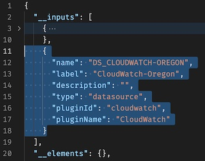
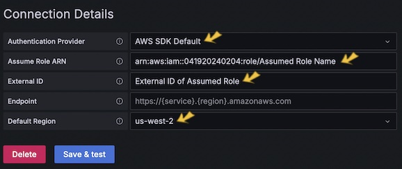
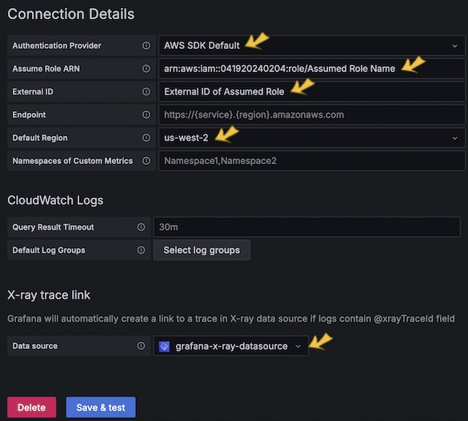

# Installation Guide for AWS Native Cross-account Observability Dashboard

<br>

This guide will walk you through the steps to set up the necessary data sources and import **the AWS Native Cross-account Observability Dashboard** into your Grafana instance.

- [Installation Guide for AWS Native Cross-account Observability Dashboard](#installation-guide-for-aws-native-cross-account-observability-dashboard)
  - [🪩 Prerequisites](#-prerequisites)
    - [☻ Step 1: Set Up Data Endpoints](#-step-1-set-up-data-endpoints)
    - [☻ Step 2: Clone or Download the Dashboard files](#-step-2-clone-or-download-the-dashboard-files)
      - [✰ Optional: Adjust Dashboard for Non-Cross-Account Setups](#-optional-adjust-dashboard-for-non-cross-account-setups)
    - [☻ Step 3: Configure Data Sources in Grafana](#-step-3-configure-data-sources-in-grafana)
      - [✰ Infinity](#-infinity)
      - [✰ Business Input](#-business-input)
      - [✰ X-Ray](#-x-ray)
      - [✰ ☁️Centralized 🔴CloudWatch Logs \& 🔴CloudTrail (integrated X-Ray)](#-️centralized-cloudwatch-logs--cloudtrail-integrated-x-ray)
    - [☻ Step 4: Import the Dashboard](#-step-4-import-the-dashboard)
  - [🪩 Conclusion](#-conclusion)

---

<br>

## 🪩 Prerequisites

Before you begin, ensure that you have:
- A working Grafana instance.
- Access to the [**AWS Native Observability Exporters**](https://github.com/your-username/aws-native-observability-exporters) repository. (Before set up the **🚀AWS Configuration Management**)

---

<br>

|Dashboard|Datasource|
|---|---|
|**🚀AWS Configuration Management**|☑️ `CloudWatch`(Core)<br>☑️ `Infinity`(Core)<br>☑️ `Business Input`|
|**🚀AWS Serverless Overview**|☑️ `CloudWatch`(Core)<br>☑️ `X-Ray`(Core)<br>☑️ `Business Input`|
|**🚀AWS Configuration Management**|☑️ `CloudWatch`(Core)<br>☑️ `X-Ray`(Core)<br>☑️ `Business Input`|

<br>

### ☻ Step 1: Set Up Data Endpoints

First, you need to set up the endpoints of necessary data by using the AWS Native Observability Exporters.

1. Clone the [**AWS Native Observability Exporters**](https://github.com/your-username/aws-native-observability-exporters) repository to your local machine.
2. Follow the installation instructions in the repository's README.md to set up each exporter.

---

<br>

### ☻ Step 2: Clone or Download the Dashboard files

Next, you need to clone this repository:

```bash
git clone https://github.com/Hideki-Morita/aws-native-observability-dashboard.git
```

Alternatively, you can download the `dashboard JSON` files directly from this repository, from the **Grafana's Dashboard library**(down below for you) or using dashboard Id.

|Dashboard|ID|
|---|---|
|[**🚀AWS Configuration Management**](https://grafana.com/grafana/dashboards/21814-aws-configuration-management/)|**`21814`**|
|[**🚀AWS Serverless Overview**](https://grafana.com/grafana/dashboards/21933-aws-serverless-overview/)|**`21933`**|
|[**🚀AWS Configuration Management**](https://grafana.com/grafana/dashboards/21935-aws-serverless-security-and-access-logs/)|**`21935`**|

---

<br>

#### ✰ Optional: Adjust Dashboard for Non-Cross-Account Setups

If you have not yet established "<mark>**CloudWatch cross-account observability**</mark>," also known as "Centralized Logs," you will need to make a small adjustment to the `dashboard JSON` file before proceeding.  
Specifically, you'll need to delete lines related to the **CloudWatch data source** input, which requires configuration.

||
|---|
|Steps to Adjust the JSON File:|

1. **Open the Dashboard JSON File:**
   - Use a text editor to open the JSON file you downloaded.

2. **Locate the CloudWatch Data Source Input Section:**
   - Search for the section that defines the CloudWatch data source input(in `__inputs`). It should look something like this:

     ```json
     {
         "name": "DS_CLOUDWATCH-OREGON",
         "label": "CloudWatch-Oregon",
         "description": "",
         "type": "datasource",
         "pluginId": "cloudwatch",
         "pluginName": "CloudWatch"
     }
     ```
   - *Screenshot for Reference:*<br>

3. **Delete the Section:**
   - Remove the entire block related to the CloudWatch data source, as shown above.

4. **Save the JSON File:**
   - After making the changes, save the file.

5. **Continue with the Installation:**
   - You can now proceed to import the adjusted dashboard JSON file in **Step 4**.

<br>

> 💡 **Note:**
>##### **Additional Context:**
>
>- **Why Make These Changes:** 
>   - The CloudWatch data source input configuration requires the CloudWatch cross-account observability setup. If you haven't set up this centralized logging yet, removing these lines will allow you to continue using the dashboard without errors.
>  
>- **No Impact on Other Features:** 
>   - This adjustment will only affect the CloudWatch-related panels. Other aspects of the dashboard will continue to function as expected.

---

<br>

### ☻ Step 3: Configure Data Sources in Grafana

Now, you'll configure the necessary data sources in Grafana:

---

<br>

#### ✰ Infinity

1. **Navigate to Data Sources:**
   - Go to Grafana and navigate to [Home] → [Connections] → [Data sources].

2. **Add 🟢AWS Free Tier Data Source:**
   - Click "Add new data source" and type `Infinity`.
   - Name the data source **`aws-freetier-datasource`**.
   - Click "Save & Test".

3. **Repeat the Process for Other Data Sources:**
   - Add the following data sources using the same steps:
     - 🔴AWS Organizations: **`aws-organizations-datasource`**
     - 🔴AWS Identity Center: **`aws-identity-center-datasource`**
     - 🔴AWS Identity and Access Management: **`aws-iam-datasource`**

---

<br>

#### ✰ Business Input

This datasource is used for storing AWS icons as static data.

1. **Navigate to Data Source Plugins:**
   - Go to [Home] → [Administration] → [Plugins and data] → [Plugins].
   - Type "business input" in the search bar, hit enter and click "Business Input".

2. **Add Static Data Source:**
   - Click "Add new data source".
   - Name the data source **`Static-datasource`**.
   - Click "Save & Test".

---

<br>

#### ✰ X-Ray

1. **Navigate to Data Sources:**
   - Go to [Home] → [Connections] → [Data sources].

2. **Add X-Ray Data Source:**
   - Click "Add new data source" and type `x-ray`.
   - Name the data source **`grafana-x-ray-datasource`**.

3. **Set Up Connection Details:**
   - In the "Connection Details" section, configure the settings according to the screenshot provided below.
     - *Screenshot for Reference:*<br>
   - Click "Save & Test".

> ⚠️ **Important:**  
> Replace "<mark>**Assume Role ARN**</mark>" and "<mark>**External ID**</mark>", also you can change the "**Detail region**" if you want.

<br>

> 💡 **Note:**
>##### **Additional Context:**
>
>- **Why using AWS SDK Default:** 
>   - Unfortunately, The Grafana OSS doesn't support **AWS IAM Identity Center** as an authentication method. (Means temporary credentials.)
>   - So, You need set up an "IAM User" who can only do `get assume role` for the specific role.

---

<br>

#### ✰ ☁️Centralized 🔴CloudWatch Logs & 🔴CloudTrail (integrated X-Ray)

1. **Navigate to Data Sources:**
   - Go to [Home] → [Connections] → [Data sources].

2. **Add CloudWatch Logs Data Source:**
   - Click "Add new data source" and type `cloudwatch`.
   - Name the data source **`CloudWatch-Oregon`**.

3. **Set Up Connection Details:**
   - In the "Connection Details" section, configure the settings according to the screenshot provided below.
     - *Screenshot for Reference:*<br>
   - In the "X-ray trace link" section, select **`grafana-x-ray-datasource`** that you defined.
   - Click "Save & Test".

4. Optional: **Repeat the Process for other regions:**
   - For **CloudTrail**, it is supported Multi-Region and Multi-Accounts as Centralized Trace Logs, but **CloudWatch Logs** doesn't, which means, it is Regional Service.(Single-Region and Multi-Accounts)
     - e.g., **`CloudWatch-Virginia`**

Now, You're all set!🙃

---

<br>

### ☻ Step 4: Import the Dashboard

Now, you can import the dashboard into Grafana:

1. **Navigate to Dashboards:**
   - Go to [Home] → [Dashboards].

2. **Import the Dashboard:**
   - Click the "New" button, then select "Import".
   - Drag and drop the dashboard JSON file (downloaded in **Step 2**) into the square box.

3. **Assign Data Sources:**
   - For each data source prompt, select the appropriate data source you created in **Step 3**.
   - Click "Import" to finalize the setup.

---

<br>

## 🪩 Conclusion

Your **AWS Native Cross-account Observability Dashboard** should now be set up and ready to use.  
If you encounter any issues or need further assistance, please refer to the [**AWS Native Observability Exporters**](https://github.com/your-username/aws-native-observability-exporters) repository for more details or contact us directly.

---